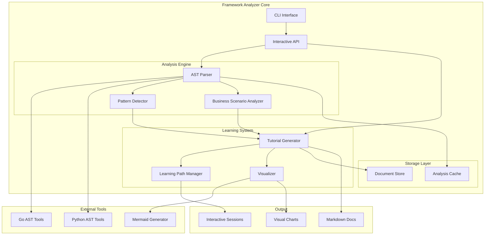

# Design Document: Framework Analyzer

## Overview

Framework Analyzer是一个智能代码分析和教学技能，专门设计用于分析Go和Python框架代码。该系统采用模块化架构，结合AST（抽象语法树）分析、设计模式识别、交互式教学和可视化生成等核心功能，为开发者提供深入的框架理解和学习体验。

系统的核心设计理念是将复杂的代码分析过程转化为结构化的学习路径，通过自动化分析工具和交互式教学界面，帮助用户从架构概览到具体实现细节的全方位理解框架设计。

## Architecture

### 系统架构图



### 核心设计原则

1. **模块化设计**: 每个功能组件独立开发和测试，支持灵活组合
2. **语言无关性**: 核心分析引擎支持多种编程语言的扩展
3. **渐进式学习**: 从整体架构到具体实现的分层教学路径
4. **交互式体验**: 用户可以控制学习节奏和深度
5. **可视化优先**: 复杂概念通过图表和图形化表示

## Components and Interfaces

### 1. Analysis Engine (分析引擎)

**职责**: 负责代码解析、结构分析和模式识别

**核心组件**:
- **AST Parser**: 解析Go和Python源代码生成抽象语法树
- **Pattern Detector**: 识别设计模式和架构模式
- **Business Scenario Analyzer**: 分析业务场景和应用领域

**接口定义**:
```go
type AnalysisEngine interface {
    ParseProject(projectPath string, language Language) (*ProjectAnalysis, error)
    DetectPatterns(ast *AST) ([]DesignPattern, error)
    AnalyzeBusinessScenario(analysis *ProjectAnalysis) (*BusinessScenario, error)
}

type ProjectAnalysis struct {
    Language     Language
    Structure    *ProjectStructure
    Dependencies []Dependency
    Components   []Component
    Interfaces   []Interface
}
```

### 2. Tutorial Generator (教程生成器)

**职责**: 基于分析结果生成结构化的教学内容

**核心功能**:
- 生成markdown格式的教学文档
- 创建分层次的学习内容
- 支持交互式内容生成

**接口定义**:
```go
type TutorialGenerator interface {
    GenerateOverview(analysis *ProjectAnalysis) (*Tutorial, error)
    GenerateModuleDeepDive(component *Component) (*Tutorial, error)
    GenerateBusinessScenarioGuide(scenario *BusinessScenario) (*Tutorial, error)
}

type Tutorial struct {
    Title       string
    Content     string
    Sections    []Section
    Visuals     []Visual
    NextSteps   []string
}
```

### 3. Learning Path Manager (学习路径管理器)

**职责**: 管理交互式学习流程和用户进度

**核心功能**:
- 定义学习路径和阶段
- 处理用户交互和选择
- 跟踪学习进度

**接口定义**:
```go
type LearningPathManager interface {
    CreateLearningPath(analysis *ProjectAnalysis, userPrefs *UserPreferences) (*LearningPath, error)
    GetNextStep(currentStep *Step, userChoice string) (*Step, error)
    HandleUserInteraction(interaction *UserInteraction) (*Response, error)
}

type LearningPath struct {
    Steps       []Step
    CurrentStep int
    UserPrefs   *UserPreferences
}
```

### 4. Visualizer (可视化生成器)

**职责**: 生成架构图、流程图和其他可视化内容

**核心功能**:
- 生成Mermaid格式的图表
- 创建依赖关系图
- 生成数据流图

**接口定义**:
```go
type Visualizer interface {
    GenerateArchitectureDiagram(analysis *ProjectAnalysis) (*Diagram, error)
    GenerateDependencyGraph(dependencies []Dependency) (*Diagram, error)
    GenerateDataFlowDiagram(components []Component) (*Diagram, error)
}

type Diagram struct {
    Type     DiagramType
    Content  string
    Format   string // mermaid, plantuml, etc.
}
```

## Data Models

### 核心数据结构

```go
// 编程语言枚举
type Language int
const (
    Go Language = iota
    Python
)

// 项目结构
type ProjectStructure struct {
    RootPath    string
    Directories []Directory
    Files       []SourceFile
}

// 组件定义
type Component struct {
    Name         string
    Type         ComponentType
    FilePath     string
    Dependencies []string
    Interfaces   []string
    Methods      []Method
    Patterns     []DesignPattern
}

// 设计模式
type DesignPattern struct {
    Name        string
    Type        PatternType
    Description string
    Examples    []CodeExample
    Location    SourceLocation
}

// 业务场景
type BusinessScenario struct {
    Domain      string
    UseCase     string
    Patterns    []string
    Middleware  []string
    Confidence  float64
}

// 用户偏好
type UserPreferences struct {
    LearningDepth    LearningDepth
    FocusAreas      []string
    PreferredFormat string
    InteractionMode InteractionMode
}
```

### 分析结果缓存

```go
type AnalysisCache struct {
    ProjectPath   string
    LastModified  time.Time
    Analysis      *ProjectAnalysis
    Tutorials     map[string]*Tutorial
    Diagrams      map[string]*Diagram
}
```

## Correctness Properties

*A property is a characteristic or behavior that should hold true across all valid executions of a system-essentially, a formal statement about what the system should do. Properties serve as the bridge between human-readable specifications and machine-verifiable correctness guarantees.*

现在我需要使用prework工具来分析需求中的接受标准，以便生成正确的属性。

基于prework分析，我将创建以下correctness properties：

### Property 1: 代码文件扫描和过滤
*For any* 有效的项目路径，扫描功能应该递归遍历目录，只返回Go和Python源代码文件，并过滤掉非相关文件类型
**Validates: Requirements 1.1, 1.5**

### Property 2: 设计模式识别准确性
*For any* 包含已知设计模式的代码示例，Pattern_Detector应该能够正确识别这些模式（MVC、依赖注入、工厂模式等）
**Validates: Requirements 1.2**

### Property 3: 组件依赖关系分析
*For any* 具有组件依赖关系的项目，Analysis_Engine应该能够正确识别和映射组件间的依赖关系和交互模式
**Validates: Requirements 1.3**

### Property 4: 分析报告结构完整性
*For any* 完成的代码分析，生成的报告应该包含架构概览和关键组件这两个必需部分
**Validates: Requirements 1.4**

### Property 5: 交互式学习会话初始化
*For any* 用户开始的学习会话，系统应该提供引导式问答来确定学习深度和重点
**Validates: Requirements 2.1**

### Property 6: 教程阶段性生成
*For any* 用户选择的学习路径，Tutorial_Generator应该按照预定义的阶段组织和展示分析结果
**Validates: Requirements 2.2**

### Property 7: Markdown格式输出
*For any* 生成的教学内容，输出应该是有效的markdown格式
**Validates: Requirements 2.3**

### Property 8: 模块深入分析响应
*For any* 用户对有效模块的深入分析请求，系统应该提供该模块的详细分析内容
**Validates: Requirements 2.4**

### Property 9: 学习重点切换灵活性
*For any* 学习过程中的重点切换请求，系统应该能够成功响应并调整分析重点
**Validates: Requirements 2.5**

### Property 10: 学习路径顺序一致性
*For any* 生成的学习路径，内容组织应该严格按照"架构概览 → 业务场景识别 → 功能模块深入"的顺序
**Validates: Requirements 3.1, 3.2, 3.3, 3.4**

### Property 11: 学习阶段跳转支持
*For any* 有效的学习阶段，用户应该能够从当前阶段跳转到任意其他阶段
**Validates: Requirements 3.5**

### Property 12: Mermaid架构图生成
*For any* 需要展示架构关系的场景，Visualizer应该生成有效的Mermaid格式架构图
**Validates: Requirements 4.1**

### Property 13: 数据流可视化
*For any* 数据流分析请求，Visualizer应该创建显示组件间交互的流程图
**Validates: Requirements 4.2**

### Property 14: 复杂依赖关系图生成
*For any* 检测到的复杂依赖关系，Visualizer应该生成相应的依赖关系图
**Validates: Requirements 4.3**

### Property 15: 智能图表类型选择
*For any* 特定类型的分析内容，Visualizer应该自动选择最适合的图表类型
**Validates: Requirements 4.4**

### Property 16: 图表markdown嵌入
*For any* 生成的图表，应该能够正确嵌入到markdown文档中
**Validates: Requirements 4.5**

### Property 17: 自动业务场景识别
*For any* 具有明确业务特征的框架代码，Business_Scenario应该能够自动识别相应的业务场景
**Validates: Requirements 5.1**

### Property 18: 框架场景匹配度验证
*For any* 用户指定的业务场景，系统应该能够计算并验证框架与场景的匹配度
**Validates: Requirements 5.2**

### Property 19: AI应用特征识别
*For any* 包含AI应用特征的代码，Business_Scenario应该正确标记为AI应用框架
**Validates: Requirements 5.3**

### Property 20: 微服务模式识别
*For any* 微服务架构的代码，Business_Scenario应该识别相关的微服务设计模式
**Validates: Requirements 5.4**

### Property 21: 中间件和数据库识别
*For any* 集成了中间件或数据库的项目，Business_Scenario应该正确识别其类型
**Validates: Requirements 5.5**

### Property 22: Go语言分析优先级
*For any* Go语言项目，Analysis_Engine应该提供完整的分析功能，性能优于其他语言
**Validates: Requirements 6.1**

### Property 23: Python辅助分析支持
*For any* Python项目，Analysis_Engine应该提供基本的分析功能
**Validates: Requirements 6.2**

### Property 24: Go特定模式识别
*For any* 包含Go并发模式和接口设计的代码，Pattern_Detector应该能够正确识别
**Validates: Requirements 6.3**

### Property 25: Python特定模式识别
*For any* 包含Python装饰器和元类模式的代码，Pattern_Detector应该能够正确识别
**Validates: Requirements 6.4**

### Property 26: 混合语言项目处理
*For any* 包含Go和Python文件的混合项目，Framework_Analyzer应该能够正确处理和分析
**Validates: Requirements 6.5**

### Property 27: 命令行参数支持
*For any* 提供的脚本，都应该支持命令行参数来配置分析选项
**Validates: Requirements 7.5**

### Property 28: 示例分析流程完整性
*For any* 提供的示例，都应该展示完整的分析流程步骤
**Validates: Requirements 8.3**

### Property 29: 目录结构组织标准
*For any* 项目文件和目录，都应该符合预定义的组织标准和清晰的结构
**Validates: Requirements 8.5**

## Error Handling

### 错误分类和处理策略

1. **输入验证错误**
   - 无效的项目路径
   - 不支持的文件格式
   - 损坏的源代码文件
   - 处理策略：提供清晰的错误消息和建议的修复方法

2. **分析引擎错误**
   - AST解析失败
   - 模式识别超时
   - 内存不足
   - 处理策略：优雅降级，提供部分分析结果

3. **可视化生成错误**
   - Mermaid语法错误
   - 图表过于复杂
   - 渲染失败
   - 处理策略：回退到文本描述或简化图表

4. **交互式会话错误**
   - 用户输入无效
   - 会话状态丢失
   - 网络连接问题
   - 处理策略：保存会话状态，提供恢复机制

### 错误恢复机制

```go
type ErrorHandler interface {
    HandleAnalysisError(err error, context *AnalysisContext) (*RecoveryAction, error)
    HandleVisualizationError(err error, diagram *Diagram) (*Diagram, error)
    HandleInteractionError(err error, session *Session) (*Session, error)
}

type RecoveryAction struct {
    Type        RecoveryType
    Message     string
    Suggestions []string
    PartialResult interface{}
}
```

## Testing Strategy

### 双重测试方法

本项目采用单元测试和基于属性的测试相结合的方法：

**单元测试重点**：
- 特定的代码分析场景和边界情况
- 错误处理和异常情况
- 集成点测试（AST解析器、可视化生成器等）
- 用户交互流程的具体示例

**基于属性的测试重点**：
- 通过随机输入验证通用属性
- 代码分析结果的一致性和正确性
- 教程生成的格式和结构完整性
- 可视化输出的有效性

### 基于属性的测试配置

- **测试框架**: 使用Go的testing/quick包和Python的Hypothesis库
- **迭代次数**: 每个属性测试最少100次迭代
- **测试标签格式**: **Feature: framework-analyzer, Property {number}: {property_text}**

### 测试数据生成策略

1. **代码样本生成**: 创建包含各种设计模式的Go和Python代码样本
2. **项目结构生成**: 生成不同复杂度的项目目录结构
3. **用户交互模拟**: 模拟各种用户学习路径和选择
4. **边界条件测试**: 测试极大项目、空项目、损坏文件等边界情况

### 集成测试策略

1. **端到端流程测试**: 从代码输入到教程输出的完整流程
2. **多语言项目测试**: 测试Go和Python混合项目的处理
3. **性能基准测试**: 测试大型项目的分析性能
4. **用户体验测试**: 验证交互式学习流程的用户友好性