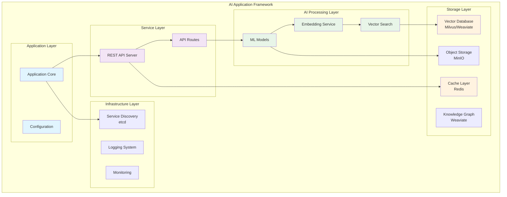

# Ai Architecture

```mermaid
graph TB
    subgraph "AI Application Framework"
        subgraph "Application Layer"
            App[Application Core]
            Config[Configuration]
        end
        
        subgraph "Service Layer"
            API[REST API Server]
            Routes[API Routes]
        end
        
        subgraph "AI Processing Layer"
            ML[ML Models]
            Embed[Embedding Service]
            Search[Vector Search]
        end
        
        subgraph "Storage Layer"
            VectorDB[Vector Database<br/>Milvus/Weaviate]
            KG[Knowledge Graph<br/>Weaviate]
            Cache[Cache Layer<br/>Redis]
            Storage[Object Storage<br/>MinIO]
        end
        
        subgraph "Infrastructure Layer"
            SD[Service Discovery<br/>etcd]
            Logger[Logging System]
            Monitor[Monitoring]
        end
    end
    
    %% Connections
    App --> API
    API --> Routes
    Routes --> ML
    ML --> Embed
    Embed --> Search
    Search --> VectorDB
    API --> Cache
    ML --> Storage
    App --> SD
    
    %% Styling
    classDef appLayer fill:#E1F5FE
    classDef serviceLayer fill:#F3E5F5
    classDef aiLayer fill:#E8F5E8
    classDef storageLayer fill:#FFF3E0
    classDef infraLayer fill:#FFEBEE
    
    class App,Config appLayer
    class API,Routes serviceLayer
    class ML,Embed,Search aiLayer
    class VectorDB storageLayer
    class Cache storageLayer
```