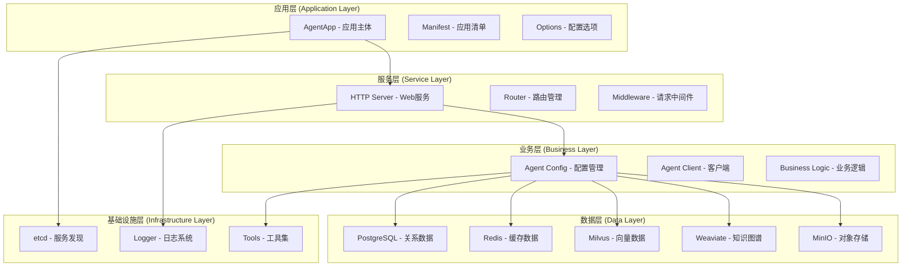
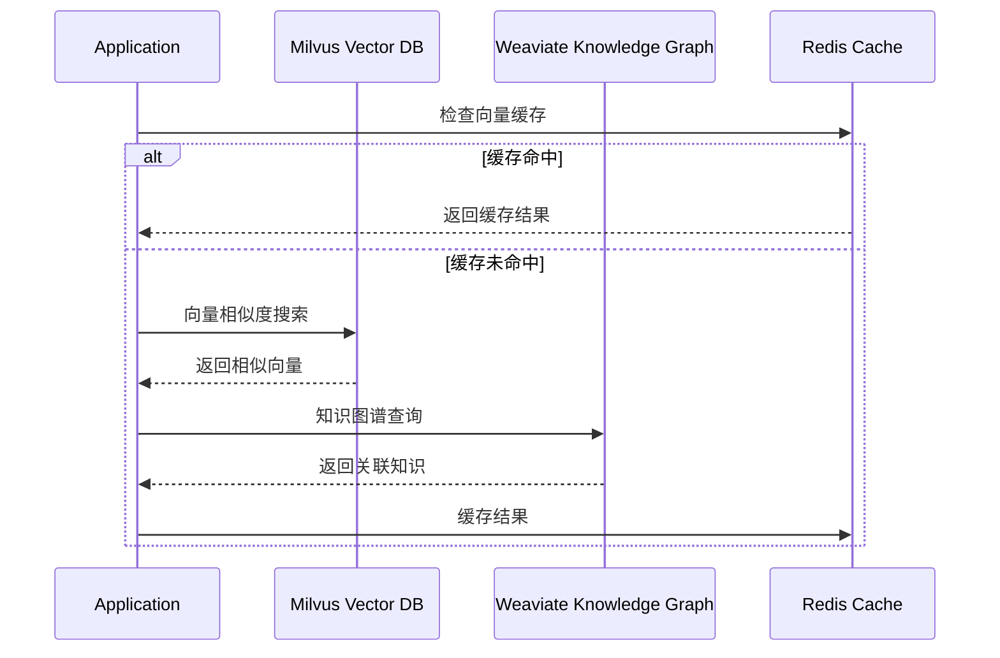
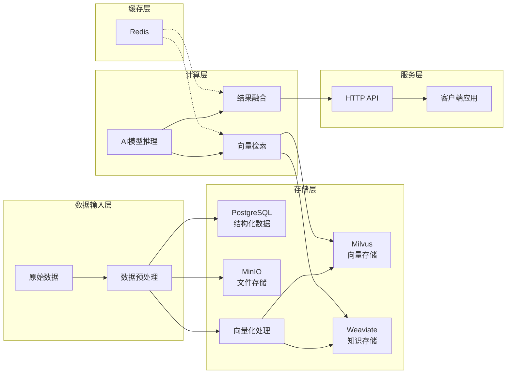
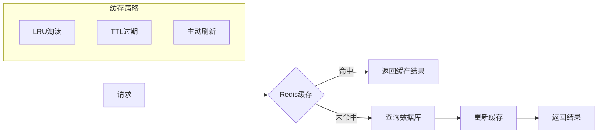

# Framework Analyzer 高级教程

## 深度分析Power-AI框架

### 目标
通过深入分析Power-AI框架，学习如何构建企业级AI应用开发框架，理解微服务架构在AI领域的应用。

## 第一部分：架构深度解析

### 1.1 分层架构设计

Power-AI采用经典的分层架构，每一层都有明确的职责：



#### 设计原则分析

**1. 单一职责原则 (SRP)**
```go
// 每个中间件都有单一的职责
type AgentApp struct {
    Manifest    *Manifest      // 只负责应用元数据
    HttpServer  *server.HttpServer  // 只负责HTTP服务
    etcd        *etcd_mw.Etcd      // 只负责服务发现
    pgsql       *pgsql_mw.PgSql    // 只负责关系数据库
    redis       *redis_mw.Redis    // 只负责缓存
    // ...
}
```

**2. 依赖倒置原则 (DIP)**
```go
// 高层模块不依赖低层模块，都依赖于抽象
type Option func(*Options)

func WithOnShutDown(fn func(ctx context.Context)) Option {
    return func(o *Options) {
        o.OnShutDown = fn
    }
}
```

**3. 开闭原则 (OCP)**
```go
// 通过Options模式支持扩展，无需修改核心代码
func NewAgent(manifest string, opts ...Option) (*AgentApp, error) {
    newOpts := newOptions(opts)  // 支持扩展新选项
    // ...
}
```

### 1.2 并发模式分析

Power-AI框架展示了Go语言中优雅的并发处理：

```go
func (a *AgentApp) Run() {
    // 模式1: 并发启动多个服务
    go func() {
        if err := a.HttpServer.RunServer(env.G.HttpServerConfig.Ip, env.G.HttpServerConfig.Port); err != nil {
            xlog.LogErrorF("10000", "httpserver", "init", 
                fmt.Sprintf("服务[%s:%s]启动失败", env.G.HttpServerConfig.Ip, env.G.HttpServerConfig.Port), err)
        }
    }()

    go a.agentClient.register(
        env.G.HttpServerConfig.Ip,
        env.G.HttpServerConfig.Port,
        a.Manifest.Code,
        a.Manifest.Name,
        a.Manifest.Version)

    // 模式2: 优雅关闭模式
    c := make(chan os.Signal, 1)
    signal.Notify(c, syscall.SIGHUP, syscall.SIGQUIT, syscall.SIGTERM, syscall.SIGINT)
    for {
        s := <-c
        switch s {
        case syscall.SIGQUIT, syscall.SIGTERM, syscall.SIGINT:
            a.HttpServer.StopServer()
            if a.OnShutdown != nil {
                a.OnShutdown(context.Background())
            }
            return
        }
    }
}
```

**并发模式解析：**

1. **Fan-out模式**: 同时启动HTTP服务和Agent注册
2. **信号处理模式**: 优雅处理系统信号
3. **Context传播模式**: 使用Context进行取消传播

## 第二部分：AI应用架构模式

### 2.1 向量数据库集成模式

Power-AI集成了两个向量数据库，体现了AI应用的典型架构：



**设计考量：**

1. **Milvus**: 专注于高性能向量检索
   - 适用场景：语义搜索、推荐系统
   - 优势：检索速度快、支持大规模向量

2. **Weaviate**: 结合向量搜索和知识图谱
   - 适用场景：知识问答、关系推理
   - 优势：GraphQL接口、语义理解

3. **Redis缓存**: 减少重复计算
   - 缓存热点向量
   - 缓存查询结果

### 2.2 数据流架构



## 第三部分：企业级特性分析

### 3.1 配置管理模式

Power-AI使用etcd实现分布式配置管理：

```go
type AgentConfig struct {
    etcd                   *etcd_mw.Etcd
    agentCode             string
    defaultConfigs        map[string]interface{}
    configChangeCallbacks map[string]func(string, interface{})
    mu                    sync.RWMutex
}
```

**配置管理特性：**

1. **集中化配置**: 所有配置存储在etcd中
2. **动态更新**: 支持运行时配置变更
3. **回调机制**: 配置变更自动通知相关组件
4. **默认值**: 提供合理的默认配置

### 3.2 服务发现模式

```go
type AgentClient struct {
    etcd *etcd_mw.Etcd
}

func (ac *AgentClient) register(ip, port, code, name, version string) {
    // 服务注册逻辑
    // 1. 构建服务信息
    // 2. 注册到etcd
    // 3. 定期心跳保活
}
```

**服务发现特性：**

1. **自动注册**: 服务启动时自动注册
2. **健康检查**: 定期心跳检测
3. **服务发现**: 其他服务可以发现此服务
4. **负载均衡**: 支持多实例部署

### 3.3 可观测性设计

```go
// 统一的日志记录
xlog.LogErrorF("10000", "httpserver", "init", 
    fmt.Sprintf("服务[%s:%s]启动失败", ip, port), err)

// 健康检查端点
func (a *AgentApp) health(c *gin.Context) {
    c.JSON(200, map[string]interface{}{
        "code":    server.ResultSuccess.Code,
        "message": server.ResultSuccess.Message,
    })
}

// 版本信息端点
func (a *AgentApp) version(c *gin.Context) {
    c.JSON(200, map[string]interface{}{
        "code":    server.ResultSuccess.Code,
        "message": server.ResultSuccess.Message,
        "data": map[string]string{
            "agent_code":        a.Manifest.Code,
            "agent_name":        a.Manifest.Name,
            "agent_version":     a.Manifest.Version,
            "framework_version": Ver,
        },
    })
}
```

## 第四部分：性能优化分析

### 4.1 连接池管理

Power-AI框架中的各个中间件都应该实现连接池：

```go
// PostgreSQL连接池示例
type PgSql struct {
    db *sqlx.DB
    config *Config
}

// Redis连接池示例  
type Redis struct {
    client *redis.Client
    config *Config
}
```

**优化策略：**

1. **连接复用**: 避免频繁创建/销毁连接
2. **连接池大小**: 根据并发量调整池大小
3. **超时设置**: 合理设置连接和查询超时
4. **健康检查**: 定期检查连接有效性

### 4.2 缓存策略



**缓存层次：**

1. **L1缓存**: 应用内存缓存
2. **L2缓存**: Redis分布式缓存
3. **L3缓存**: 数据库查询缓存

### 4.3 异步处理模式

```go
// 异步任务处理示例
type TaskProcessor struct {
    taskQueue chan Task
    workers   int
}

func (tp *TaskProcessor) Start() {
    for i := 0; i < tp.workers; i++ {
        go tp.worker()
    }
}

func (tp *TaskProcessor) worker() {
    for task := range tp.taskQueue {
        // 处理任务
        task.Process()
    }
}
```

## 第五部分：扩展和定制

### 5.1 中间件扩展

添加新的中间件组件：

```go
// 1. 定义中间件接口
type NewMiddleware interface {
    Connect() error
    Close() error
    HealthCheck() bool
}

// 2. 实现中间件
type MyMiddleware struct {
    config *Config
    client *Client
}

// 3. 集成到AgentApp
type AgentApp struct {
    // 现有字段...
    myMiddleware *MyMiddleware
}

// 4. 在NewAgent中初始化
func NewAgent(manifest string, opts ...Option) (*AgentApp, error) {
    // 现有代码...
    
    myMw, err := initMyMiddleware()
    if err != nil {
        return nil, err
    }
    
    a.myMiddleware = myMw
    return a, nil
}
```

### 5.2 业务逻辑扩展

```go
// 通过Options模式扩展路由
func WithCustomRoutes(routes map[string]gin.HandlerFunc) Option {
    return func(o *Options) {
        if o.PostRouters == nil {
            o.PostRouters = make(map[string]gin.HandlerFunc)
        }
        for k, v := range routes {
            o.PostRouters[k] = v
        }
    }
}

// 使用示例
customRoutes := map[string]gin.HandlerFunc{
    "ai/chat": handleAIChat,
    "ai/embedding": handleEmbedding,
}

agent, err := NewAgent(manifest, WithCustomRoutes(customRoutes))
```

### 5.3 配置扩展

```go
// 自定义配置结构
type AIConfig struct {
    ModelName     string `yaml:"model_name"`
    MaxTokens     int    `yaml:"max_tokens"`
    Temperature   float64 `yaml:"temperature"`
    VectorDim     int    `yaml:"vector_dim"`
}

// 配置变更回调
func onAIConfigChange(key string, value interface{}) {
    if aiConfig, ok := value.(*AIConfig); ok {
        // 更新AI模型配置
        updateAIModel(aiConfig)
    }
}

// 注册配置回调
configCallbacks := map[string]func(string, interface{}){
    "ai_config": onAIConfigChange,
}

agent, err := NewAgent(manifest, WithConfigCallbacks(configCallbacks))
```

## 第六部分：最佳实践总结

### 6.1 架构设计最佳实践

1. **分层清晰**: 每层职责明确，依赖关系清晰
2. **接口抽象**: 面向接口编程，便于测试和扩展
3. **配置外部化**: 配置与代码分离，支持多环境部署
4. **优雅关闭**: 正确处理系统信号，确保资源清理

### 6.2 AI应用特定实践

1. **多存储策略**: 根据数据特性选择合适的存储
2. **缓存优化**: 合理使用缓存减少计算开销
3. **异步处理**: 耗时操作异步化，提升响应速度
4. **监控告警**: 完善的监控和告警机制

### 6.3 性能优化实践

1. **连接池管理**: 合理配置各种连接池
2. **批量操作**: 减少网络往返次数
3. **索引优化**: 数据库和向量数据库索引优化
4. **资源限制**: 设置合理的资源使用限制

### 6.4 运维部署实践

1. **容器化部署**: 使用Docker容器化部署
2. **服务发现**: 基于etcd的服务发现机制
3. **配置管理**: 集中化配置管理
4. **日志收集**: 统一的日志收集和分析

## 总结

Power-AI框架展示了现代AI应用开发框架的典型架构模式：

1. **微服务架构**: 组件化、可扩展的架构设计
2. **多存储集成**: 针对不同数据类型的专业化存储
3. **企业级特性**: 配置管理、服务发现、可观测性
4. **性能优化**: 连接池、缓存、异步处理
5. **扩展性设计**: 通过接口和配置支持灵活扩展

这种架构模式可以作为构建其他AI应用的参考模板，特别适用于需要处理大量向量数据和知识图谱的应用场景。