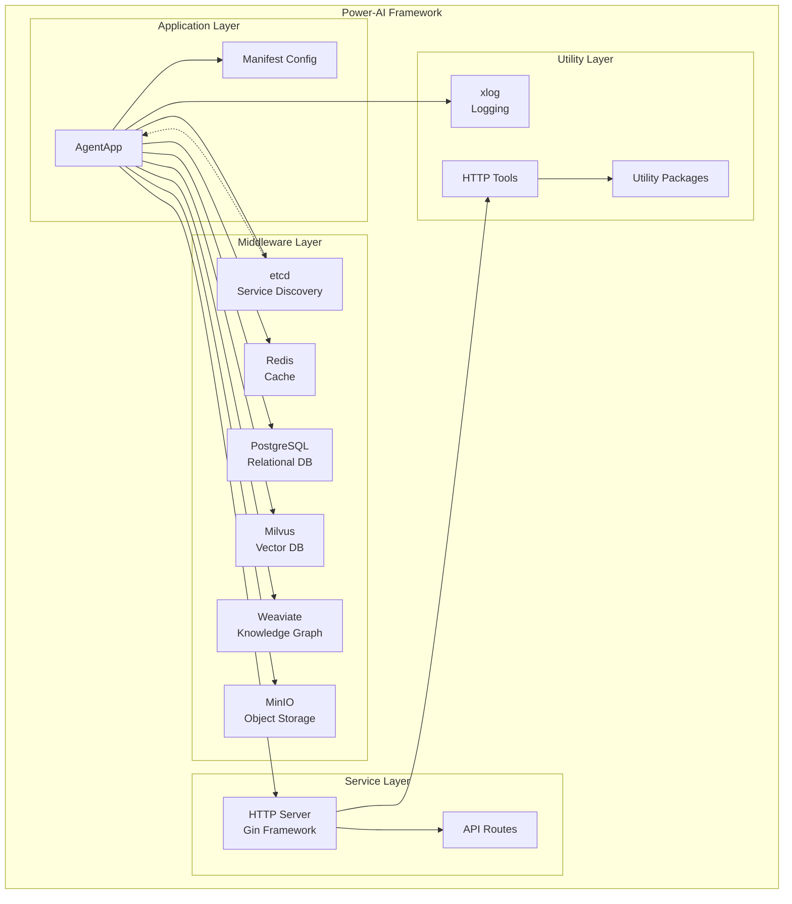

# Framework Analyzer 基础使用示例

## 示例1: 分析Power-AI框架

### 项目背景
Power-AI是一个基于Go语言的AI应用开发框架，集成了多种中间件和存储组件。

### 分析步骤

#### 1. 启动分析
```bash
cd /path/to/power-ai-framework-v4
python /path/to/framework-analyzer/scripts/analyzer.py --path . --language go --interactive
```

#### 2. 交互式分析过程
```
🤖 Framework Analyzer: 正在扫描项目结构...

📁 发现项目结构:
├── powerai.go (主入口文件)
├── middleware/ (中间件层)
│   ├── etcd/
│   ├── redis/
│   ├── pgsql/
│   ├── milvus/
│   ├── weaviate/
│   └── minio/
├── pkg/ (工具包)
└── tools/ (工具类)

🔍 检测到的技术栈:
- Go 1.25.2
- Gin Web框架
- etcd (服务发现)
- Redis (缓存)
- PostgreSQL (关系数据库)
- Milvus (向量数据库)
- Weaviate (知识图谱)
- MinIO (对象存储)

🎯 业务场景识别:
基于检测到的组件，这是一个 **AI应用开发框架**
- 置信度: 95%
- 主要用途: 构建需要向量搜索和知识管理的AI应用
- 适用场景: RAG系统、智能问答、文档检索

请选择学习路径:
1. 📋 架构概览 - 了解整体设计
2. 🎯 业务场景深入 - AI应用开发模式
3. 🔧 核心组件分析 - 中间件集成方式
4. 📊 生成可视化图表

您的选择 (1-4): 1
```

#### 3. 架构概览分析
```
📋 正在生成架构概览...

## Power-AI Framework 架构分析

### 🏗️ 整体架构

Power-AI采用**分层架构**设计，主要包含以下层次:

1. **应用层** (AgentApp)
   - 应用程序主体
   - 生命周期管理
   - 路由配置

2. **服务层** (HTTP Server)
   - RESTful API
   - 健康检查
   - 版本信息

3. **中间件层** (Middleware)
   - 数据存储 (PostgreSQL, Redis)
   - 向量存储 (Milvus, Weaviate)
   - 对象存储 (MinIO)
   - 服务发现 (etcd)

4. **工具层** (Packages & Tools)
   - 通用工具包
   - HTTP客户端
   - 日志系统

### 🎨 设计模式识别

✅ **依赖注入模式**
- 位置: `NewAgent()` 函数
- 实现: 通过Options模式注入配置和回调

✅ **工厂模式**
- 位置: `NewAgent()` 函数
- 作用: 创建和初始化AgentApp实例

✅ **单例模式**
- 位置: `env.G` 全局配置
- 作用: 全局环境变量管理

✅ **适配器模式**
- 位置: 各个中间件包装器
- 作用: 统一不同中间件的接口

### 🔄 核心流程

1. **初始化流程**
   ```
   manifest解析 → 环境初始化 → 中间件初始化 → 路由配置 → 服务启动
   ```

2. **请求处理流程**
   ```
   HTTP请求 → Gin路由 → 业务逻辑 → 中间件调用 → 响应返回
   ```

3. **生命周期管理**
   ```
   启动 → 注册服务 → 监听信号 → 优雅关闭
   ```

是否需要生成架构图? (y/n): y
```

#### 4. 架构图生成
```
📊 正在生成架构图...

已生成 Mermaid 架构图，保存到: power_ai_architecture.md



继续深入分析? 
1. 🔧 中间件集成详解
2. 📝 代码实现细节
3. 🚀 使用示例生成
4. 💡 最佳实践建议

您的选择 (1-4): 1
```

#### 5. 中间件集成分析
```
🔧 正在分析中间件集成方式...

## 中间件集成架构

### 🗄️ 数据存储层

#### PostgreSQL 集成
- **用途**: 关系型数据持久化
- **配置**: 通过环境变量配置连接参数
- **特点**: 支持事务、复杂查询

#### Redis 集成  
- **用途**: 缓存、会话存储
- **配置**: 支持集群和单机模式
- **特点**: 高性能、内存存储

### 🧠 AI存储层

#### Milvus 集成
- **用途**: 向量数据库，存储和检索向量嵌入
- **应用场景**: 
  - 语义搜索
  - 相似度匹配
  - 推荐系统
- **特点**: 高性能向量检索

#### Weaviate 集成
- **用途**: 知识图谱数据库
- **应用场景**:
  - 知识管理
  - 图谱查询
  - 关系推理
- **特点**: GraphQL接口、向量搜索

### 📁 对象存储层

#### MinIO 集成
- **用途**: 对象存储服务
- **应用场景**:
  - 文件上传下载
  - 媒体资源存储
  - 数据备份
- **特点**: S3兼容API

### 🔍 服务发现层

#### etcd 集成
- **用途**: 分布式配置管理、服务发现
- **功能**:
  - 配置热更新
  - 服务注册与发现
  - 分布式锁
- **特点**: 强一致性、高可用

### 🔗 集成模式分析

**统一初始化模式**:
```go
// 所有中间件都遵循相同的初始化模式
etcd, err := initEtcd()
redis := initRedis(etcd)
pgsql := initPgSQL(etcd)
```

**配置驱动模式**:
- 所有中间件配置都通过etcd统一管理
- 支持运行时配置更新
- 配置变更自动通知相关组件

**错误处理模式**:
- 统一的错误处理和日志记录
- 优雅降级机制
- 健康检查集成

保存详细分析报告? (y/n): y
```

### 生成的文档结构
```
power-ai-analysis/
├── architecture_overview.md     # 架构概览
├── middleware_analysis.md       # 中间件分析
├── design_patterns.md          # 设计模式详解
├── business_scenarios.md       # 业务场景分析
├── diagrams/
│   ├── architecture.mermaid    # 架构图
│   ├── dataflow.mermaid       # 数据流图
│   └── dependencies.mermaid    # 依赖关系图
└── code_examples/
    ├── initialization.go       # 初始化示例
    ├── middleware_usage.go     # 中间件使用示例
    └── best_practices.go       # 最佳实践
```

## 示例2: Python项目分析

### 分析Django项目
```bash
python scripts/analyzer.py --path /path/to/django/project --language python
```

### 输出示例
```
🐍 Python项目分析结果:

📁 项目结构:
- Django Web框架
- MVT架构模式
- 数据库: PostgreSQL
- 缓存: Redis

🎨 检测到的设计模式:
✅ MVC/MVT模式
✅ 装饰器模式 (@login_required, @cache_page)
✅ 中间件模式
✅ 观察者模式 (Django Signals)

🎯 业务场景: Web应用开发框架
```

## 示例3: 混合语言项目

### 分析包含Go和Python的项目
```bash
python scripts/analyzer.py --path /path/to/mixed/project --language mixed
```

### 分析结果
```
🔄 混合语言项目分析:

Go组件:
- 微服务后端
- gRPC API服务
- 高性能计算模块

Python组件:  
- 数据处理脚本
- 机器学习模型
- Web管理界面

跨语言交互:
- gRPC通信
- REST API调用
- 共享数据格式 (Protocol Buffers)
```

## 高级使用技巧

### 1. 自定义分析规则
```yaml
# custom_rules.yaml
patterns:
  microservice_pattern:
    indicators:
      - "grpc"
      - "consul"
      - "kubernetes"
    confidence: 0.9

business_scenarios:
  fintech:
    keywords: ["payment", "transaction", "wallet"]
    patterns: ["saga", "cqrs"]
```

### 2. 批量分析
```bash
# 分析多个项目
for project in projects/*; do
    python scripts/analyzer.py --path "$project" --output "analysis_$(basename $project).md"
done
```

### 3. 生成对比报告
```bash
python scripts/analyzer.py --compare project1/ project2/ --output comparison.md
```

## 学习建议

### 对于初学者
1. 从架构概览开始
2. 理解核心设计模式
3. 学习中间件集成方式
4. 实践代码示例

### 对于有经验的开发者
1. 深入分析设计模式
2. 研究性能优化点
3. 学习最佳实践
4. 扩展和定制框架

### 对于架构师
1. 分析架构决策
2. 评估技术选型
3. 识别改进机会
4. 制定迁移策略