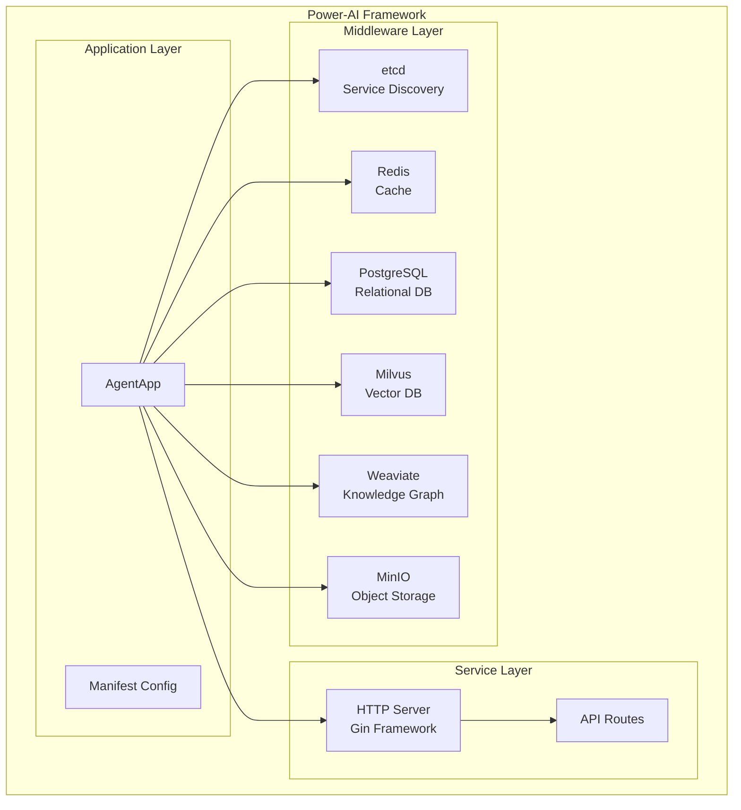
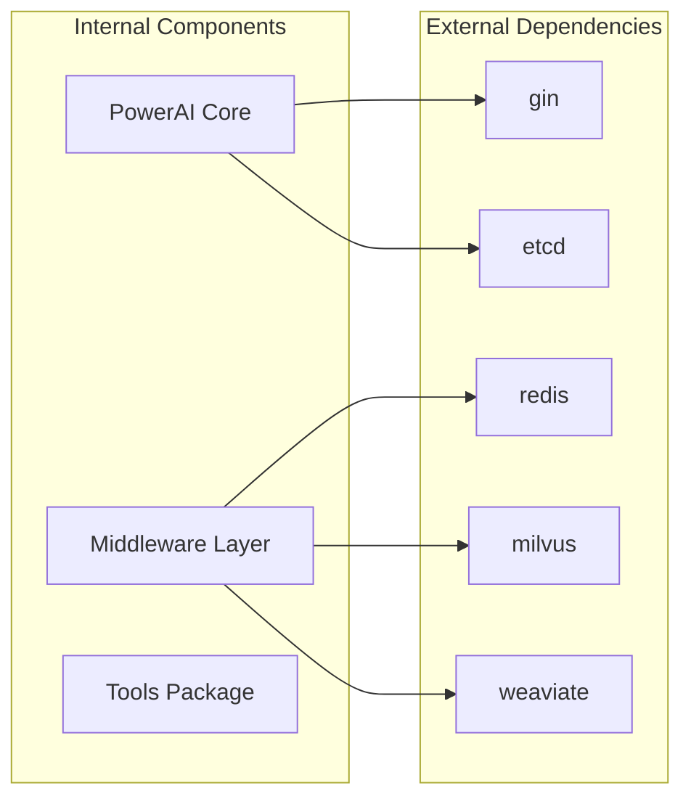

# Power-AI Framework 分析演示

## 演示目标
通过分析 Power-AI 框架，展示 Framework Analyzer 技能的完整功能。

## 分析步骤

### 1. 基础分析
```bash
cd /path/to/power-ai-framework-v4
python /path/to/framework-analyzer/scripts/analyzer.py --path . --language go
```

**预期输出：**
```
🔍 正在扫描项目: /path/to/power-ai-framework-v4
📁 发现项目结构:
├── powerai.go (主入口文件)
├── middleware/ (中间件层)
├── pkg/ (工具包)
└── tools/ (工具类)

📋 检测到语言: go
🎨 发现 5 个设计模式
🎯 业务场景: AI Application (置信度: 0.95)

📋 分析结果:
语言: go
业务场景: AI Application
设计模式: 5 个
组件: 12 个
```

### 2. 交互式学习
```bash
python /path/to/framework-analyzer/scripts/analyzer.py --path . --interactive
```

**交互流程演示：**
```
🤖 Framework Analyzer 交互式学习
==================================================

📁 项目概览:
   路径: /path/to/power-ai-framework-v4
   语言: go
   文件: 15 Go, 0 Python
   总行数: 2847
   组件: 12 个

🎯 业务场景: AI Application
   描述: AI应用开发框架，支持向量搜索、知识图谱、机器学习模型部署
   置信度: 0.95
   中间件: Service Discovery, Cache, Database, Vector Database, Knowledge Graph, Object Storage

📚 学习路径选择:
   1. 架构概览
   2. 业务场景深入
   3. 设计模式详解
   4. 核心组件分析
   5. 可视化生成

请选择学习路径 (1-5, q): 1

📖 架构概览
------------------------------
🏗️ 整体架构分析:
   主要组件: middleware, pkg, tools, powerai, agent
   依赖数量: 25
   核心依赖: github.com/gin-gonic/gin, go.etcd.io/etcd/client/v3, github.com/go-redis/redis/v7

📊 项目统计:
   目录数: 15
   文件数: 28
   代码行数: 2847

🔧 Go项目特征:
   - 使用Go模块管理依赖
   - 可能采用微服务架构
   - 使用Gin Web框架
   - 集成etcd服务发现

是否需要生成架构图? (y/n): y

📊 正在生成架构图...
已生成 Mermaid 架构图，保存到: power_ai_architecture.md
```

### 3. 设计模式检测
```bash
python /path/to/framework-analyzer/scripts/pattern_detector.py --path . --patterns factory,singleton,dependency_injection
```

**预期输出：**
```
🎯 检测指定模式: factory, singleton, dependency_injection
🔍 正在分析项目模式: /path/to/power-ai-framework-v4
📁 发现 15 个Go文件
✅ 模式分析完成: 发现 3 个模式

📊 分析摘要:
   总模式数: 3
   Creational: 2
   Architectural: 1

🔍 详细结果:
   - Factory Pattern (0.90) in powerai.go:85
   - Dependency Injection (0.95) in powerai_options.go:12
   - Singleton Pattern (0.75) in env/env.go:23
```

### 4. 可视化生成
```bash
python /path/to/framework-analyzer/scripts/visualizer.py --path . --type all
```

**生成的图表：**

#### 架构图 (architecture_diagram.md)


#### 依赖关系图 (dependency_graph.md)


### 5. 教程生成
```bash
python /path/to/framework-analyzer/scripts/tutorial_generator.py --path . --type all
```

**生成的教程文件：**
- `tutorials/architecture_overview.md` - 架构概览教程
- `tutorials/getting_started.md` - 快速入门指南
- `tutorials/best_practices.md` - 最佳实践指南

### 6. 完整分析报告
```bash
python /path/to/framework-analyzer/scripts/analyzer.py --path . --output power_ai_analysis.json
```

**生成的分析报告结构：**
```json
{
  "language": "go",
  "structure": {
    "root_path": "/path/to/power-ai-framework-v4",
    "total_lines": 2847,
    "go_files": 15,
    "python_files": 0
  },
  "patterns": [
    {
      "name": "Factory Pattern",
      "type": "creational",
      "confidence": 0.90,
      "location": "powerai.go"
    }
  ],
  "scenario": {
    "domain": "AI Application",
    "confidence": 0.95,
    "middleware": ["etcd", "Redis", "PostgreSQL", "Milvus", "Weaviate", "MinIO"]
  },
  "components": ["middleware", "pkg", "tools", "powerai", "agent"],
  "dependencies": ["github.com/gin-gonic/gin", "go.etcd.io/etcd/client/v3"]
}
```

## 分析结果总结

### 🏗️ 架构特点
- **分层架构**: 清晰的应用层、服务层、中间件层分离
- **微服务设计**: 支持分布式部署和服务发现
- **AI优化**: 专门针对AI应用场景优化的架构

### 🎨 设计模式
- **工厂模式**: `NewAgent()` 函数实现对象创建
- **依赖注入**: 通过 Options 模式实现灵活配置
- **单例模式**: 全局环境配置管理

### 🔧 技术栈
- **Web框架**: Gin (高性能HTTP框架)
- **服务发现**: etcd (分布式配置和服务注册)
- **数据存储**: PostgreSQL + Redis + Milvus + Weaviate + MinIO
- **并发处理**: Go原生goroutine和channel

### 💡 业务场景
- **主要用途**: AI应用开发框架
- **适用场景**: RAG系统、智能问答、文档检索、知识管理
- **核心能力**: 向量搜索、知识图谱、多模态数据处理

### 📈 性能特点
- **高并发**: Go语言天然支持高并发处理
- **低延迟**: 向量数据库优化的检索性能
- **可扩展**: 微服务架构支持水平扩展
- **高可用**: 分布式组件和服务发现机制

## 学习建议

### 对于初学者
1. 从快速入门指南开始
2. 理解基本的AI应用概念
3. 学习Go语言基础
4. 实践简单的示例项目

### 对于有经验的开发者
1. 深入分析架构设计
2. 学习设计模式的应用
3. 理解中间件集成方式
4. 优化性能和扩展功能

### 对于架构师
1. 分析技术选型决策
2. 评估架构的优缺点
3. 学习AI应用架构模式
4. 制定团队开发规范

## 扩展应用

### 1. 自定义分析规则
可以通过修改 `config.yaml` 添加自定义的模式检测规则和业务场景识别关键词。

### 2. 集成CI/CD
将框架分析集成到持续集成流程中，自动生成架构文档和代码质量报告。

### 3. 团队协作
使用生成的教程和文档帮助新团队成员快速上手项目。

### 4. 架构演进
定期运行分析，跟踪架构变化和代码质量趋势。