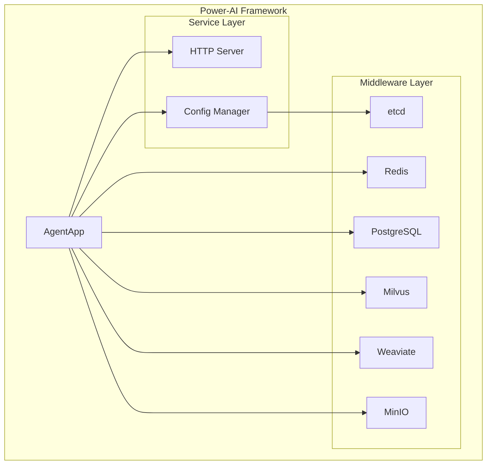

# Framework Analyzer - 智能框架代码分析与教学技能

## 概述

Framework Analyzer 是一个专门用于分析和教学Go/Python框架代码的智能技能。它通过自动化代码分析、设计模式识别、交互式学习和可视化生成，帮助开发者深入理解框架架构、设计模式和业务场景。

## 核心功能

### 🔍 智能代码分析
- **AST解析**: 深度解析Go和Python源代码结构
- **设计模式识别**: 自动识别MVC、依赖注入、工厂模式等常见模式
- **组件依赖分析**: 分析组件间的依赖关系和交互模式
- **业务场景识别**: 基于代码特征自动识别AI、微服务等业务领域

### 📚 交互式学习体验
- **引导式教程**: 通过对话方式确定学习深度和重点
- **分层学习路径**: 架构概览 → 业务场景识别 → 功能模块深入
- **阶段性文档**: 自动生成markdown格式的学习文档
- **按需深入**: 用户可选择深入分析特定模块

### 📊 可视化支持
- **架构图生成**: 自动生成Mermaid格式的系统架构图
- **依赖关系图**: 可视化组件间的复杂依赖关系
- **数据流图**: 展示系统中的数据流向和处理过程
- **智能图表选择**: 根据内容自动选择最适合的图表类型

### 🛠️ 多语言支持
- **Go语言优先**: 完整支持Go框架分析，包括并发模式和接口设计
- **Python辅助**: 支持Python框架的基础分析和特有模式识别
- **混合项目**: 处理Go和Python混合的项目结构

## 安装和配置

### 系统要求
- Go 1.19+
- Python 3.8+
- Git

### 依赖安装
```bash
# Go依赖
go mod tidy

# Python依赖
pip install -r requirements.txt
```

### 配置文件
创建 `config.yaml` 文件：
```yaml
analysis:
  max_file_size: 10MB
  supported_extensions: [".go", ".py"]
  exclude_dirs: ["vendor", "node_modules", ".git"]

visualization:
  default_format: "mermaid"
  max_nodes: 50

learning:
  default_depth: "intermediate"
  interaction_timeout: 300
```

## 使用方法

### 1. 基础分析
```bash
# 分析Go项目
python scripts/analyzer.py --path /path/to/go/project --language go

# 分析Python项目
python scripts/analyzer.py --path /path/to/python/project --language python

# 混合项目分析
python scripts/analyzer.py --path /path/to/mixed/project --language mixed
```

### 2. 交互式学习
```bash
# 启动交互式学习会话
python scripts/analyzer.py --interactive --path /path/to/project
```

交互式会话示例：
```
🤖 Framework Analyzer: 欢迎使用框架分析器！

我发现这是一个Go语言的AI框架项目。让我们开始分析：

1. 📋 架构概览 - 了解整体结构
2. 🎯 业务场景分析 - 识别应用领域  
3. 🔧 功能模块深入 - 详细分析组件

请选择您想要开始的学习路径 (1-3): 1

正在分析项目架构...

✅ 分析完成！发现以下关键组件：
- AgentApp: 主应用程序结构
- 中间件层: etcd, Redis, PostgreSQL, Milvus, Weaviate
- HTTP服务: 基于Gin的REST API
- 配置管理: 基于etcd的分布式配置

是否需要生成架构图？(y/n): y
```

### 3. 可视化生成
```bash
# 生成架构图
python scripts/visualizer.py --path /path/to/project --type architecture

# 生成依赖关系图
python scripts/visualizer.py --path /path/to/project --type dependency

# 生成数据流图
python scripts/visualizer.py --path /path/to/project --type dataflow
```

### 4. 设计模式检测
```bash
# 检测设计模式
python scripts/pattern_detector.py --path /path/to/project --patterns all

# 检测特定模式
python scripts/pattern_detector.py --path /path/to/project --patterns mvc,factory,singleton
```

### 5. 教程生成
```bash
# 生成完整教程
python scripts/tutorial_generator.py --path /path/to/project --output tutorial.md

# 生成特定模块教程
python scripts/tutorial_generator.py --path /path/to/project --module AgentApp --output agent_tutorial.md
```

## 输出示例

### 架构分析报告
```markdown
# Power-AI Framework 架构分析

## 整体架构

这是一个基于Go语言的AI应用框架，采用微服务架构设计。

### 核心组件
- **AgentApp**: 主应用程序，管理整个Agent的生命周期
- **中间件层**: 集成多种存储和计算组件
- **HTTP服务**: 提供RESTful API接口
- **配置管理**: 分布式配置和服务发现

### 设计模式
- ✅ **依赖注入**: 通过Options模式注入依赖
- ✅ **工厂模式**: NewAgent函数作为工厂方法
- ✅ **单例模式**: 全局环境配置管理
```

### 可视化图表


## 高级功能

### 自定义分析规则
创建 `custom_rules.yaml`:
```yaml
patterns:
  custom_ai_pattern:
    name: "AI Service Pattern"
    description: "检测AI服务相关的代码模式"
    indicators:
      - "milvus"
      - "weaviate"
      - "embedding"
      - "vector"

business_scenarios:
  ai_application:
    keywords: ["ai", "ml", "embedding", "vector", "llm"]
    confidence_threshold: 0.8
```

### 扩展支持
```python
# 自定义语言支持
class CustomLanguageAnalyzer:
    def parse_ast(self, file_path):
        # 实现自定义语言的AST解析
        pass
    
    def detect_patterns(self, ast):
        # 实现自定义模式检测
        pass
```

## API参考

### 核心类和方法

#### AnalysisEngine
```python
class AnalysisEngine:
    def parse_project(self, project_path: str, language: str) -> ProjectAnalysis:
        """解析项目结构和代码"""
        
    def detect_patterns(self, ast: AST) -> List[DesignPattern]:
        """检测设计模式"""
        
    def analyze_business_scenario(self, analysis: ProjectAnalysis) -> BusinessScenario:
        """分析业务场景"""
```

#### TutorialGenerator
```python
class TutorialGenerator:
    def generate_overview(self, analysis: ProjectAnalysis) -> Tutorial:
        """生成架构概览教程"""
        
    def generate_module_deep_dive(self, component: Component) -> Tutorial:
        """生成模块深入分析"""
```

#### Visualizer
```python
class Visualizer:
    def generate_architecture_diagram(self, analysis: ProjectAnalysis) -> Diagram:
        """生成架构图"""
        
    def generate_dependency_graph(self, dependencies: List[Dependency]) -> Diagram:
        """生成依赖关系图"""
```

## 故障排除

### 常见问题

**Q: 分析大型项目时内存不足**
A: 调整配置文件中的 `max_file_size` 和 `exclude_dirs` 设置

**Q: 无法识别自定义设计模式**
A: 创建 `custom_rules.yaml` 文件定义自定义模式

**Q: 生成的图表过于复杂**
A: 调整 `visualization.max_nodes` 参数或使用过滤选项

**Q: Python项目分析不完整**
A: 确保安装了所有Python依赖，检查项目结构是否符合标准

### 调试模式
```bash
# 启用详细日志
python scripts/analyzer.py --path /path/to/project --verbose --debug

# 生成调试报告
python scripts/analyzer.py --path /path/to/project --debug-output debug_report.json
```

## 贡献指南

### 开发环境设置
```bash
# 克隆项目
git clone <repository-url>
cd framework-analyzer

# 安装开发依赖
go mod download
pip install -r requirements-dev.txt

# 运行测试
go test ./...
python -m pytest tests/
```

### 添加新语言支持
1. 在 `analyzers/` 目录下创建新的语言分析器
2. 实现 `LanguageAnalyzer` 接口
3. 添加相应的测试用例
4. 更新文档

### 添加新的设计模式
1. 在 `patterns/` 目录下定义模式规则
2. 实现模式检测逻辑
3. 添加测试用例和示例代码

## 许可证

MIT License - 详见 LICENSE 文件

## 支持和反馈

- 📧 Email: support@framework-analyzer.com
- 🐛 Issues: GitHub Issues
- 💬 讨论: GitHub Discussions
- 📖 文档: https://docs.framework-analyzer.com